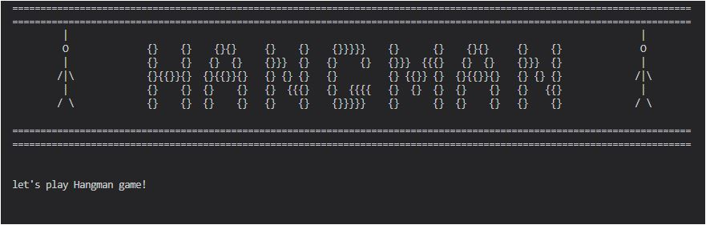
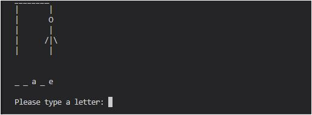
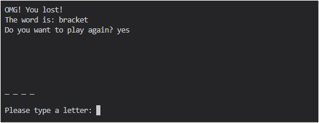
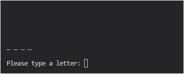

# HANGMAN Game
Hangman is a python terminal game, which runs in the Code Institute mock terminal on Heroku.This game is about guessing letters (A-Z) to form the words. If the player guesses the right letter that is within the word, the letter appears at its correct position. The user has to guess the correct word until a man is hung, then the game is over.

## Features
- have a "Hangman" representation at the beginning of the game
- it has text file including all the words. 

  

- display step by step the hangman by every wrong attempt
- If the player makes a wrong guess, the number of chances decreases by one, and the wrong guess is saved.
- If the player makes a right guess, the dashes which correspond to that guess get replaced with that guess and the guess is saved with no reduction in the number of chances.

   

- alow repeated play with a fresh word
- If the player uses all of his chances and is still unable to guess the word then it’s game over and ask the user to play again
- If the player is able to guess the word correctly then he/she wins the game.

   

- limit the number of guesses per word

   

# Data Model
In this game I used lists to display hangman when user type wrong character. the game create one instance of the Hangman class to display the user the hangman game. the class also has method to help play the game, such as print method to display the hangman and remaining chance to play. 

# Testing
I have manually tested this project by doing the following:
- passed the code through a PEP8 and confirmed there are no problems.
- Tested in my local terminal and Code Institute Heroko terminal

## Validator Testing
- PEP8 
  - No error were found from PEP8online.com

# Deployment
this project was deployed using Code Institute's mock terminal for Heroku.

- Steps for deplpyment:
  - create this repository
  - create a new Heroku app
  - set the buildbacks to Python and NodeJs in that order
  - link the Heroku app to the repository
  - click on Deploy

# Credits
- Code Institute for the deployment terminal
- Wikipedia for the details of the Hangman game

 

